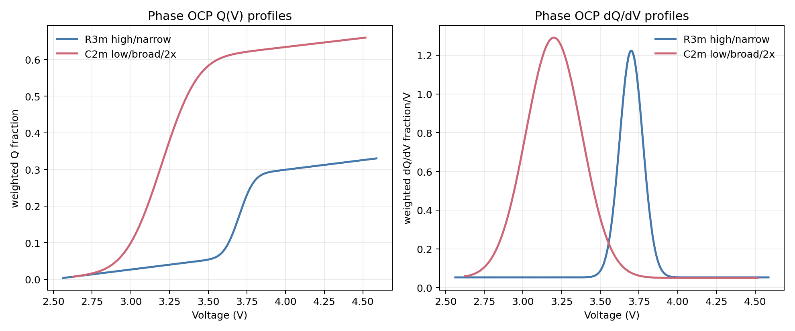
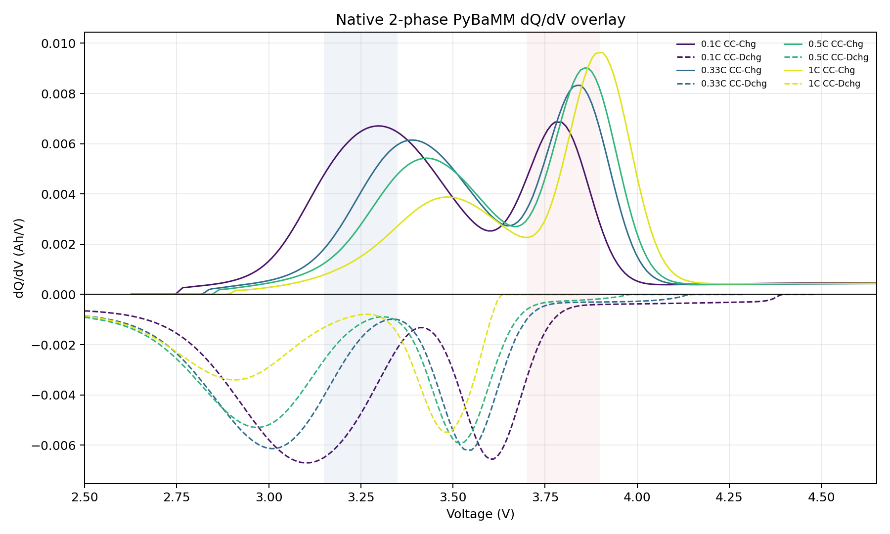

# Gaussian C2m Low Broad 2x D100x Slow 검증

## 목적

C2m OCP redox profile을 낮은 전압에 넓게 배치하고, electrode-level Q(V) contribution이 R3m보다 약 2배가 되도록 설정했다.

```text
R3m: high voltage, narrow Gaussian
C2m: low voltage, broad Gaussian, 2x weighted Q contribution
```

## OCP Q(V) 및 dQ/dV Profile

아래 플롯은 PyBaMM에 넣은 phase OCP basis에서 계산한 weighted `Q(V)`와 weighted `dQ/dV`다. 여기서 weight는 active material fraction 비율을 반영한다.



| Phase | OCP center | sigma | active fraction ratio | weighted Q span | phase dQ/dV peak |
|---|---:|---:|---:|---:|---:|
| R3m | `3.70 V` | `0.075 V` | `1` | `0.3267` | `3.700 V` |
| C2m | `3.20 V` | `0.18 V` | `2` | `0.6533` | `3.199 V` |

C2m의 weighted Q span은 R3m의 약 2배다. C2m Gaussian은 R3m보다 낮은 전압에 있고 폭도 넓다.

## Simulation 조건

| 항목 | 설정 |
|---|---:|
| 모델 | PyBaMM native positive-electrode 2-phase SPM |
| OCP shape | full-range Gaussian redox OCP |
| R3m center / sigma | `3.70 V` / `0.075 V` |
| C2m center / sigma | `3.20 V` / `0.18 V` |
| R3m diffusivity | `4.59e-17 m2/s` |
| C2m diffusivity | `1.00e-18 m2/s` |
| R3m radius | `1.5e-7 m` |
| C2m radius | `1.5e-7 m` |
| R3m active material fraction | `0.2217` |
| C2m active material fraction | `0.4433` |
| C-rate | `0.1C`, `0.33C`, `0.5C`, `1C` |
| 전압 범위 | `2.5 V` to `4.65 V` |
| Rest | 충전/방전 사이 `10 min`, 방전/충전 사이 `10 min` |
| dQ/dV 계산 | `Q(V)` 10 mV grid interpolation 후 finite difference |
| 2C | 제외 |

## Terminal dQ/dV



방전 dQ/dV의 주요 feature는 다음과 같다.

| C-rate | C2m low/broad feature | R3m high/narrow feature |
|---:|---:|---:|
| `0.1C` | `3.100 V`, `-0.00671 Ah/V` | `3.600 V`, `-0.00655 Ah/V` |
| `0.33C` | `3.010 V`, `-0.00614 Ah/V` | `3.540 V`, `-0.00622 Ah/V` |
| `0.5C` | `2.970 V`, `-0.00529 Ah/V` | `3.520 V`, `-0.00594 Ah/V` |
| `1C` | `2.910 V`, `-0.00340 Ah/V` | `3.480 V`, `-0.00550 Ah/V` |

C2m은 낮은 전압에 넓게 배치했고 diffusivity가 낮기 때문에, C-rate가 커질수록 더 낮은 전압으로 이동하고 peak amplitude가 줄어든다.

## 산출물

- TOYO CSV: `data/raw/toyo/native_2phase_gaussian_c2m_low_broad_2x_D100x_slow_sample/Toyo_LMR_native2phase_PyBaMM_0p1C_0p33C_0p5C_1C.csv`
- OCP basis CSV: `data/raw/toyo/native_2phase_gaussian_c2m_low_broad_2x_D100x_slow_sample/native_phase_ocp_basis.csv`
- OCP Q(V) / dQ/dV plot: `data/raw/toyo/native_2phase_gaussian_c2m_low_broad_2x_D100x_slow_sample/phase_ocp_qv_and_dqdv_profiles.png`
- OCP Q(V) summary: `data/raw/toyo/native_2phase_gaussian_c2m_low_broad_2x_D100x_slow_sample/phase_ocp_qv_profile_summary.json`
- terminal dQ/dV overlay: `data/raw/toyo/native_2phase_gaussian_c2m_low_broad_2x_D100x_slow_sample/native_2phase_dqdv_overlay_by_crate.png`
- terminal dQ/dV summary: `data/raw/toyo/native_2phase_gaussian_c2m_low_broad_2x_D100x_slow_sample/native_2phase_dqdv_overlay_summary.json`
- true parameter: `data/raw/toyo/native_2phase_gaussian_c2m_low_broad_2x_D100x_slow_sample/true_native_2phase_parameters.json`
- round-trip parse: `data/raw/toyo/native_2phase_gaussian_c2m_low_broad_2x_D100x_slow_sample/roundtrip_check.json`

## 판단

요청한 조건은 반영됐다. C2m은 R3m보다 낮은 전압, 넓은 OCP redox profile, 약 2배의 weighted Q contribution을 갖는다. terminal dQ/dV에서는 current sharing과 diffusion polarization 때문에 OCP basis의 면적비가 그대로 peak 높이 2배로 나타나지는 않지만, OCP Q(V) 기준으로는 C2m contribution이 R3m의 약 2배다.
