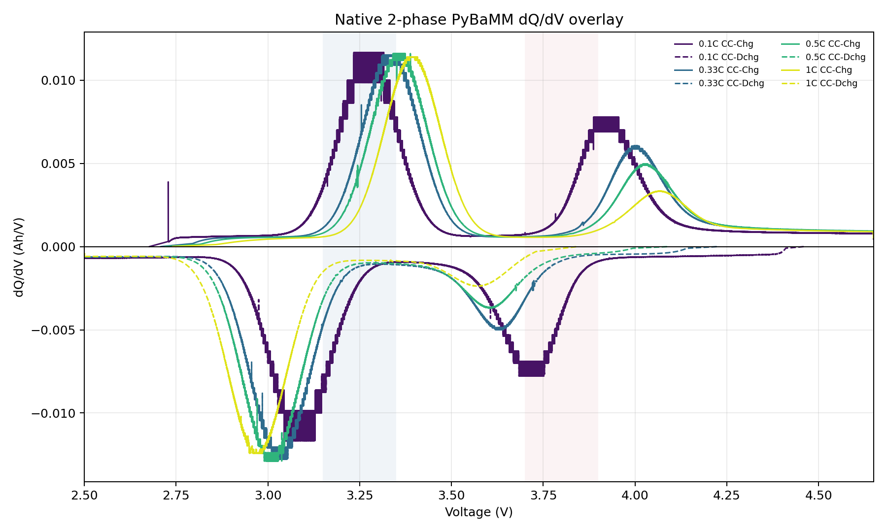
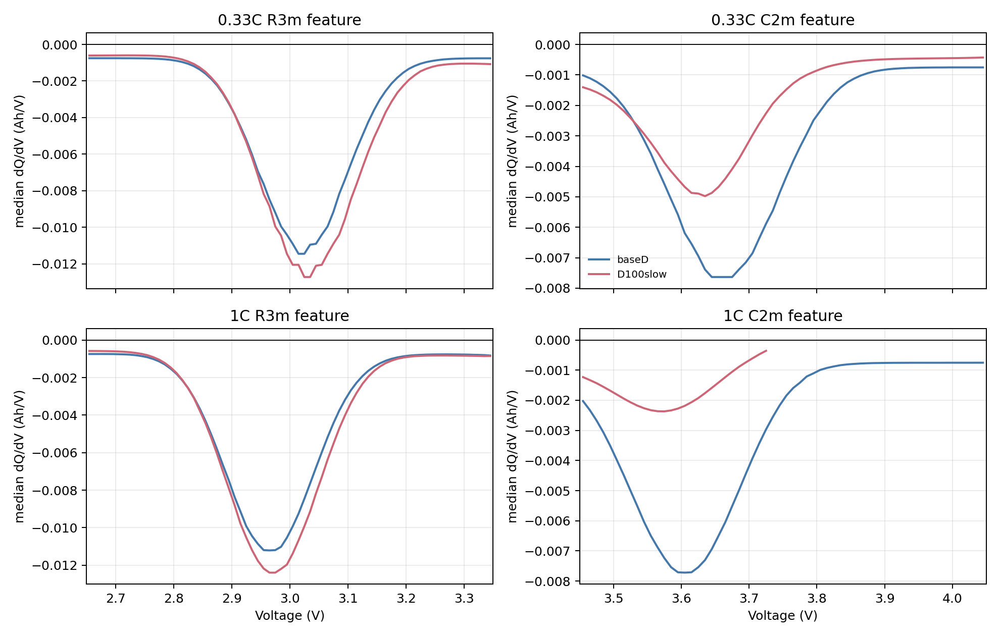

# Gaussian Redox Full-Range D100x Slow 검증

## 목적

기존 full-range Gaussian OCP 조건에서 diffusivity를 `100x` 낮춰 다시 계산했다. 반경과 OCP는 유지하고, diffusion time scale만 키워 C-rate별 dQ/dV peak shift와 peak 감쇠가 더 뚜렷하게 나타나는지 확인했다.

## 변경 조건

| 항목 | 기존 full-range Gaussian | D100x slow |
|---|---:|---:|
| R3m diffusivity | `4.59e-15 m2/s` | `4.59e-17 m2/s` |
| C2m diffusivity | `1.00e-16 m2/s` | `1.00e-18 m2/s` |
| D ratio, R3m/C2m | `45.9x` | `45.9x` |
| R3m radius | `1.5e-7 m` | `1.5e-7 m` |
| C2m radius | `1.5e-7 m` | `1.5e-7 m` |
| R3m R2/D | `4.90 s` | `490 s` |
| C2m R2/D | `225 s` | `22500 s` |

OCP는 full-range Gaussian이다. 즉 R3m과 C2m 모두 `2.50-4.65 V` 전체 전압 영역에서 redox density를 정의하고 적분해서 OCP로 사용한다.

## Terminal dQ/dV

아래 플롯은 기존 full-range Gaussian과 D100x slow 케이스를 10 mV bin median dQ/dV로 비교한 것이다. raw 미분 spike 영향을 줄이기 위해 median binning을 사용했다.

## Robust Peak 비교

10 mV bin median 기준 방전 dQ/dV peak는 다음과 같다.

| Case | C-rate | R3m feature | C2m feature |
|---|---:|---:|---:|
| Base D | `0.33C` | `3.015 V`, `-0.01145 Ah/V` | `3.655 V`, `-0.00763 Ah/V` |
| D100x slow | `0.33C` | `3.035 V`, `-0.01272 Ah/V` | `3.635 V`, `-0.00498 Ah/V` |
| Base D | `1C` | `2.965 V`, `-0.01121 Ah/V` | `3.605 V`, `-0.00772 Ah/V` |
| D100x slow | `1C` | `2.965 V`, `-0.01239 Ah/V` | `3.575 V`, `-0.00237 Ah/V` |

D100x slow에서 C2m peak는 더 낮은 전압으로 이동하고, 특히 1C에서 peak 크기가 크게 약해진다. 이는 C2m이 강하게 diffusion-limited 상태가 되었기 때문이다.

## Concentration Gradient 진단

1C full-range Gaussian 조건에서 surface/average concentration과 radial span을 확인했다.

| Phase | max surface-average difference | max radial span | max radial span / cmax |
|---|---:|---:|---:|
| R3m | `693 mol/m3` | `1650 mol/m3` | `3.47%` |
| C2m | `25158 mol/m3` | `40628 mol/m3` | `85.5%` |

기존 D에서는 C2m radial span이 약 `2.32%` 수준이었다. D100x slow에서는 C2m radial gradient가 매우 커져서 terminal dQ/dV에 diffusivity 차이가 훨씬 강하게 반영된다.

## 산출물

- TOYO CSV: `data/raw/toyo/native_2phase_gaussian_redox_fullrange_D100x_slow_sample/Toyo_LMR_native2phase_PyBaMM_0p1C_0p33C_0p5C_1C.csv`
- dQ/dV overlay: `data/raw/toyo/native_2phase_gaussian_redox_fullrange_D100x_slow_sample/native_2phase_dqdv_overlay_by_crate.png`
- binned comparison plot: `data/raw/toyo/native_2phase_gaussian_redox_fullrange_D100x_slow_sample/D100slow_vs_base_binned_dqdv_zoom.png`
- binned peak summary: `data/raw/toyo/native_2phase_gaussian_redox_fullrange_D100x_slow_sample/D100slow_vs_base_binned_peak_summary.json`
- diffusion diagnostic: `data/raw/toyo/native_2phase_gaussian_redox_fullrange_D100x_slow_sample/diffusion_timescale_diagnostic.json`
- true parameter: `data/raw/toyo/native_2phase_gaussian_redox_fullrange_D100x_slow_sample/true_native_2phase_parameters.json`
- round-trip parse: `data/raw/toyo/native_2phase_gaussian_redox_fullrange_D100x_slow_sample/roundtrip_check.json`

## 판단

사용자 판단대로 이전 diffusivity는 `R=150 nm` 조건에서는 너무 빠른 편이라, 46배 D 차이가 있어도 terminal dQ/dV에서 큰 차이가 덜 보였다. D를 `100x` 낮추면 C2m의 `R2/D`가 `22500 s`로 커지고, 1C에서 radial gradient가 `cmax`의 `85.5%`까지 커져 peak shift와 peak 감쇠가 분명해진다.
