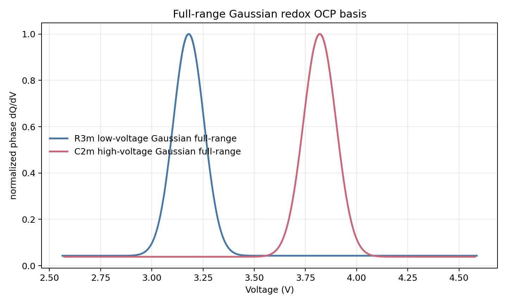
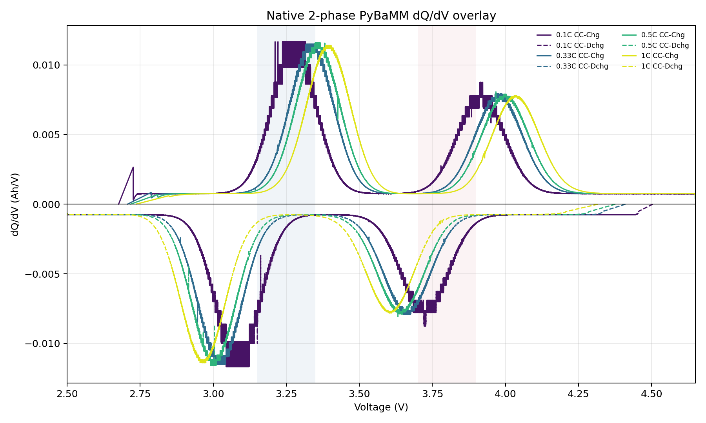

# Gaussian Redox Full-Range OCP 검증

## 결론

기존 Gaussian redox OCP는 R3m을 `2.50-3.38 V`, C2m을 `3.38-4.62 V`로 나눠 정의했다. 이 방식은 각 phase OCP가 stoichiometry 전체에는 정의되더라도, phase별 전압 support가 분리되어 terminal dQ/dV에서 인공적인 꺾임이나 phase 전환처럼 보일 수 있다.

수정 후에는 R3m과 C2m 모두 `2.50-4.65 V` 전체 전압 영역에서 OCP를 정의했다. 각 phase의 dQ/dV redox density를 전체 전압축에서 Gaussian으로 두고, 이를 적분한 뒤 `s(V)`를 역변환해 PyBaMM OCP로 사용했다.

## Full-Range Phase Basis

| Phase | 전압 정의 영역 | Gaussian center | 확인된 phase-level peak |
|---|---:|---:|---:|
| R3m / Primary | `2.50-4.65 V` | `3.18 V` | `3.181 V` |
| C2m / Secondary | `2.50-4.65 V` | `3.82 V` | `3.821 V` |

`native_phase_ocp_basis.csv`는 stoichiometry `0.01-0.99`만 저장하므로 파일에서 보이는 전압 min/max는 약 `2.56-4.59 V`다. 생성 함수 자체는 `2.50-4.65 V` 전체 영역에서 적분한다.

## Terminal dQ/dV

방전 dQ/dV에서 두 feature가 저전압 R3m, 고전압 C2m로 분리된다.

| C-rate | R3m 저전압 feature | C2m 고전압 feature |
|---:|---:|---:|
| `0.1C` | `3.092 V`, `-0.01400 Ah/V` | `3.724 V`, `-0.00875 Ah/V` |
| `0.33C` | `3.039 V`, `-0.01150 Ah/V` | `3.670 V`, `-0.00793 Ah/V` |
| `0.5C` | `3.006 V`, `-0.01160 Ah/V` | `3.632 V`, `-0.00807 Ah/V` |
| `1C` | `2.963 V`, `-0.01139 Ah/V` | `3.611 V`, `-0.00781 Ah/V` |

C-rate가 올라갈수록 두 feature 모두 낮은 방전 전압으로 이동한다. C2m은 낮은 diffusivity 때문에 고전압 Gaussian center `3.82 V`보다 terminal 방전 peak가 더 낮게 나타난다.

## 조건

| 항목 | 설정 |
|---|---:|
| 모델 | PyBaMM native positive-electrode 2-phase SPM |
| OCP shape | full-range Gaussian redox OCP |
| Phase mapping | Primary = R3m, Secondary = C2m |
| R3m radius | `1.5e-7 m` |
| C2m radius | `1.5e-7 m` |
| R3m diffusivity | `4.59e-15 m2/s` |
| C2m diffusivity | `1.00e-16 m2/s` |
| 전압 범위 | `2.5 V` to `4.65 V` |
| C-rate | `0.1C`, `0.33C`, `0.5C`, `1C` |
| Rest | 충전/방전 사이 `10 min`, 방전/충전 사이 `10 min` |
| 출력 period | `0.5 s` |
| 2C | 제외 |

## 산출물

- TOYO CSV: `data/raw/toyo/native_2phase_gaussian_redox_fullrange_sample/Toyo_LMR_native2phase_PyBaMM_0p1C_0p33C_0p5C_1C.csv`
- true parameter: `data/raw/toyo/native_2phase_gaussian_redox_fullrange_sample/true_native_2phase_parameters.json`
- phase OCP basis: `data/raw/toyo/native_2phase_gaussian_redox_fullrange_sample/native_phase_ocp_basis.csv`
- phase Gaussian plot: `data/raw/toyo/native_2phase_gaussian_redox_fullrange_sample/gaussian_fullrange_phase_redox_dqdv_basis.png`
- OCP continuity check: `data/raw/toyo/native_2phase_gaussian_redox_fullrange_sample/gaussian_fullrange_ocp_continuity_check.json`
- terminal dQ/dV overlay: `data/raw/toyo/native_2phase_gaussian_redox_fullrange_sample/native_2phase_dqdv_overlay_by_crate.png`
- terminal dQ/dV summary: `data/raw/toyo/native_2phase_gaussian_redox_fullrange_sample/native_2phase_dqdv_overlay_summary.json`
- round-trip parse: `data/raw/toyo/native_2phase_gaussian_redox_fullrange_sample/roundtrip_check.json`

## 판단

사용자 지적대로 각 phase OCP는 전압 전체 영역에 정의하고 적분해서 쓰는 편이 맞다. full-range Gaussian 방식이 phase별 전압 support 분할을 제거하므로, 이전 Gaussian 케이스보다 불연속/꺾임 위험이 낮다.

## Diffusivity 차이가 작게 보이는 이유

설정은 잘못 들어간 것이 아니다. `true_native_2phase_parameters.json`와 PyBaMM parameter 주입부를 확인하면 다음 값이 별도 phase에 들어간다.

| Phase | D | R | R2/D |
|---|---:|---:|---:|
| R3m / Primary | `4.59e-15 m2/s` | `1.5e-7 m` | `4.90 s` |
| C2m / Secondary | `1.00e-16 m2/s` | `1.5e-7 m` | `225 s` |

D는 약 `45.9x` 차이나지만, 동일 반경 `150 nm`에서는 느린 C2m도 diffusion time scale이 `225 s` 정도다. 반면 rest는 `600 s`이고, 1C 방전 시간도 수천 초 규모다. 즉 현재 조건에서는 C2m도 심하게 diffusion-limited 상태가 아니다.

1C full-range Gaussian 케이스에서 surface/average concentration 차이를 직접 확인한 결과도 같다.

| Phase | max radial concentration span / cmax | max surface-average difference |
|---|---:|---:|
| R3m | `0.035%` | `6.99 mol/m3` |
| C2m | `2.32%` | `463.5 mol/m3` |

C2m의 gradient가 R3m보다 크기는 하지만, terminal dQ/dV peak shift를 크게 벌릴 정도로 강하지 않다. 따라서 C-rate별 peak shift가 비슷하게 보이는 주된 이유는 버그라기보다 `R=150 nm` 조건에서 `R2/D`가 너무 작고, 10분 rest로 충분히 relaxation이 되기 때문이다.

Diffusivity 차이가 terminal dQ/dV에서 더 크게 드러나게 하려면 다음 중 하나가 필요하다.

- C2m radius를 다시 키운다. 예: `R_C2m = 0.5-1.0 um`
- C2m diffusivity를 더 낮춘다. 예: `1e-17 m2/s` 이하
- rest 시간을 줄이거나 제거한다.
- C-rate를 더 높인다. 단, 현재 solver는 2C에서 불안정할 수 있다.

진단 파일: `data/raw/toyo/native_2phase_gaussian_redox_fullrange_sample/diffusion_timescale_diagnostic.json`
