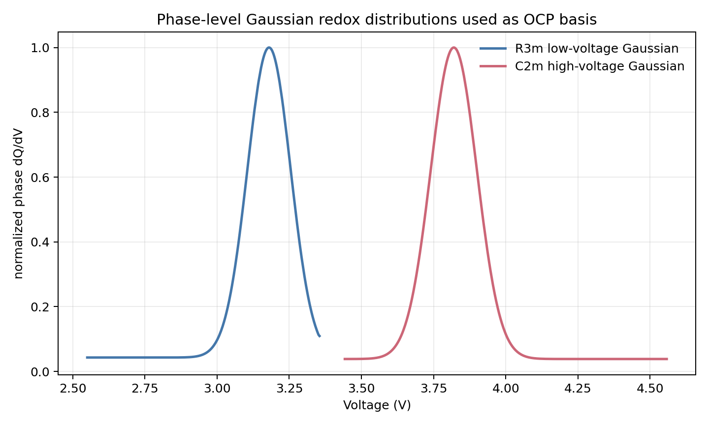
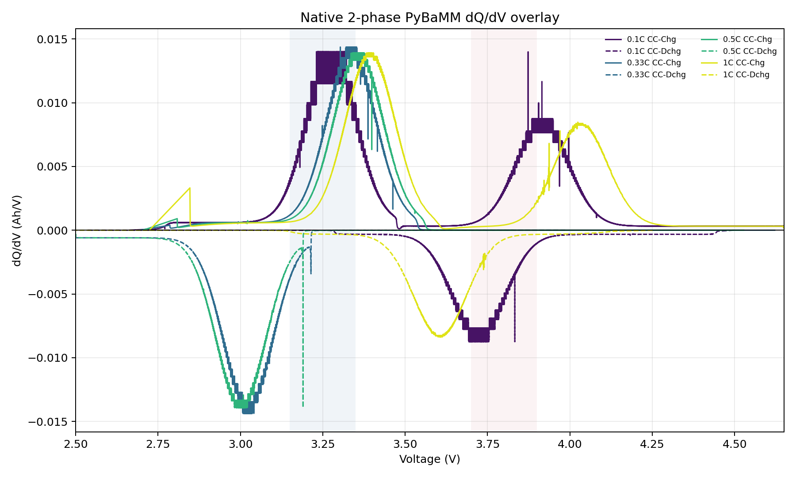

# Gaussian Redox Phase dQ/dV 검증

## 목적

각 phase의 redox contribution이 dQ/dV profile에서 Gaussian 형태가 되도록 OCP basis를 다시 구성했다. R3m은 저전압 Gaussian, C2m은 고전압 Gaussian으로 설정했다.

## Phase-Level Gaussian Basis

아래 플롯은 PyBaMM에 넣은 phase OCP basis에서 역산한 이상적인 phase-level dQ/dV다. 이 기준에서는 R3m과 C2m redox가 각각 Gaussian peak로 분리된다.

| Phase | target redox | phase-level peak |
|---|---:|---:|
| R3m / Primary | 저전압 Gaussian | `3.180 V` |
| C2m / Secondary | 고전압 Gaussian | `3.820 V` |

## Simulation 조건

| 항목 | 설정 |
|---|---:|
| 모델 | PyBaMM native positive-electrode 2-phase SPM |
| OCP shape | Gaussian redox OCP |
| Phase mapping | Primary = R3m, Secondary = C2m |
| R3m radius | `1.5e-7 m` |
| C2m radius | `1.5e-7 m` |
| R3m diffusivity | `4.59e-15 m2/s` |
| C2m diffusivity | `1.00e-16 m2/s` |
| R3m active material fraction | `0.399` |
| C2m active material fraction | `0.266` |
| C-rate | `0.1C`, `0.33C`, `0.5C`, `1C` |
| 전압 범위 | `2.5 V` to `4.65 V` |
| Rest | 충전/방전 사이 `10 min`, 방전/충전 사이 `10 min` |
| 출력 period | `0.5 s` |
| 2C | 제외 |

## Terminal dQ/dV 결과

아래는 실제 PyBaMM terminal voltage와 TOYO 형식 capacity에서 계산한 dQ/dV overlay다. 충전은 양수, 방전은 음수로 표시했다.

Terminal dQ/dV는 phase-level Gaussian basis와 완전히 같지는 않다. 이유는 terminal profile이 두 phase의 OCP만이 아니라 phase별 current sharing, diffusivity, particle concentration gradient, cutoff 조건을 함께 반영하기 때문이다.

## Terminal Peak 요약

| C-rate | Charge 주요 peak | Discharge 주요 peak |
|---:|---:|---:|
| `0.1C` | C2m `3.873 V`, R3m `3.231 V` | C2m `3.833 V` |
| `0.33C` | R3m `3.303 V` | R3m `3.032 V` |
| `0.5C` | R3m `3.341 V` | R3m `3.190 V` |
| `1C` | R3m `3.349 V` | C2m `3.606 V` |

0.1C에서는 C2m 고전압 Gaussian peak가 terminal 방전에서도 명확히 보인다. 고율에서는 C2m의 느린 diffusivity와 phase current sharing 때문에 terminal dQ/dV에서 C2m peak가 약해지거나 전압이 내려간다. 따라서 “phase redox 자체를 Gaussian으로 설정”한 것과 “terminal dQ/dV가 두 Gaussian peak로 항상 선명히 보이는 것”은 다르다.

## 산출물

- 생성 스크립트: `scripts/generate_toyo_native_2phase_sample.py --ocp-shape gaussian --phase-radius-m 1.5e-7 --out-dir data/raw/toyo/native_2phase_gaussian_redox_sample`
- 분석 스크립트: `scripts/analyze_native_2phase_sample.py --out-dir data/raw/toyo/native_2phase_gaussian_redox_sample`
- TOYO CSV: `data/raw/toyo/native_2phase_gaussian_redox_sample/Toyo_LMR_native2phase_PyBaMM_0p1C_0p33C_0p5C_1C.csv`
- true parameter: `data/raw/toyo/native_2phase_gaussian_redox_sample/true_native_2phase_parameters.json`
- phase Gaussian basis plot: `data/raw/toyo/native_2phase_gaussian_redox_sample/gaussian_phase_redox_dqdv_basis.png`
- terminal dQ/dV overlay: `data/raw/toyo/native_2phase_gaussian_redox_sample/native_2phase_dqdv_overlay_by_crate.png`
- terminal dQ/dV summary: `data/raw/toyo/native_2phase_gaussian_redox_sample/native_2phase_dqdv_overlay_summary.json`
- protocol summary: `data/raw/toyo/native_2phase_gaussian_redox_sample/native_2phase_protocol_step_summary.json`
- round-trip parse: `data/raw/toyo/native_2phase_gaussian_redox_sample/roundtrip_check.json`

## 결론

OCP basis 수준에서는 R3m 저전압 redox와 C2m 고전압 redox가 Gaussian으로 설정됐다. 다만 terminal dQ/dV에서는 고율로 갈수록 C2m peak가 current sharing과 diffusion polarization 때문에 약해지거나 낮은 전압으로 이동한다. 따라서 phase-level Gaussian redox 설정은 정상이며, terminal dQ/dV에서 Gaussian이 그대로 보이는지는 transport 조건에 의존한다.
