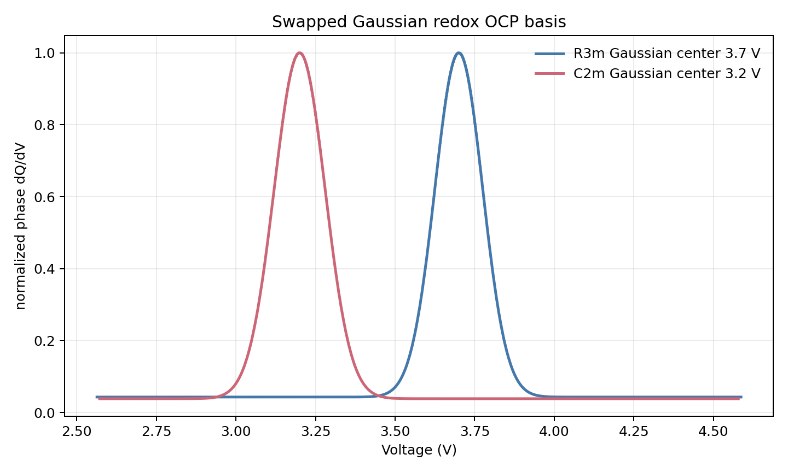
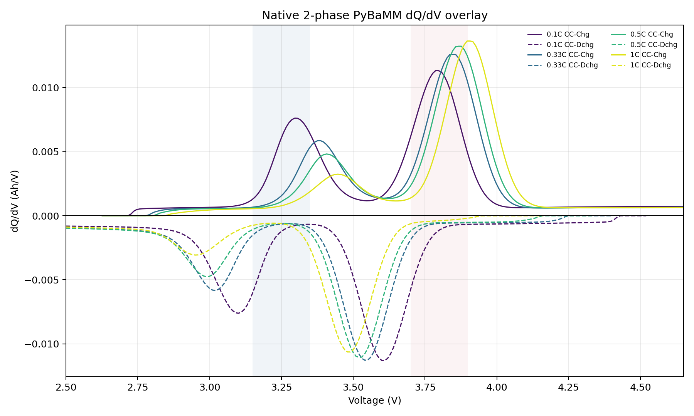

# Gaussian Redox Swapped Centers D100x Slow 검증

## 목적

기존 D100x slow full-range Gaussian 조건에서 OCP Gaussian center만 변경했다.

```text
R3m center = 3.70 V
C2m center = 3.20 V
```

Diffusivity, radius, active fraction, voltage window, rest 조건은 유지했다.

## Phase-Level OCP Basis



| Phase | requested center | confirmed phase-level peak |
|---|---:|---:|
| R3m / Primary | `3.70 V` | `3.701 V` |
| C2m / Secondary | `3.20 V` | `3.200 V` |

두 phase OCP 모두 `2.50-4.65 V` 전체 전압 영역에서 Gaussian redox density를 정의하고 적분해서 사용했다.

## Simulation 조건

| 항목 | 설정 |
|---|---:|
| 모델 | PyBaMM native positive-electrode 2-phase SPM |
| OCP shape | full-range Gaussian redox OCP |
| R3m diffusivity | `4.59e-17 m2/s` |
| C2m diffusivity | `1.00e-18 m2/s` |
| R3m radius | `1.5e-7 m` |
| C2m radius | `1.5e-7 m` |
| D ratio, R3m/C2m | `45.9x` |
| C-rate | `0.1C`, `0.33C`, `0.5C`, `1C` |
| 전압 범위 | `2.5 V` to `4.65 V` |
| Rest | 충전/방전 사이 `10 min`, 방전/충전 사이 `10 min` |
| 출력 period | `0.5 s` |
| 2C | 제외 |

## Terminal dQ/dV



현재 terminal dQ/dV는 raw point-wise 미분이 아니라 `Q(V)`를 `10 mV` 균일 전압 grid로 interpolation한 뒤 finite difference로 계산했다. 저 C-rate에서 같은 전압 구간에 과도하게 많은 점이 찍혀 선이 두껍게 보이는 문제를 줄이기 위한 처리다.

이번 케이스에서는 phase center를 바꿨으므로, terminal dQ/dV 해석도 바뀐다.

- 저전압 feature는 C2m center `3.20 V` 쪽이다.
- 고전압 feature는 R3m center `3.70 V` 쪽이다.

| C-rate | C2m 저전압 feature | R3m 고전압 feature |
|---:|---:|---:|
| `0.1C` | `3.100 V`, `-0.00761 Ah/V` | `3.610 V`, `-0.01130 Ah/V` |
| `0.33C` | `3.020 V`, `-0.00583 Ah/V` | `3.540 V`, `-0.01129 Ah/V` |
| `0.5C` | `2.990 V`, `-0.00475 Ah/V` | `3.520 V`, `-0.01110 Ah/V` |
| `1C` | `2.950 V`, `-0.00307 Ah/V` | `3.490 V`, `-0.01063 Ah/V` |

고율로 갈수록 C2m 저전압 feature가 더 낮은 전압으로 이동하고 약해진다. 이는 C2m의 diffusivity가 `1e-18 m2/s`로 매우 낮기 때문이다.

## 산출물

- TOYO CSV: `data/raw/toyo/native_2phase_gaussian_redox_swapped_centers_D100x_slow_sample/Toyo_LMR_native2phase_PyBaMM_0p1C_0p33C_0p5C_1C.csv`
- phase OCP basis: `data/raw/toyo/native_2phase_gaussian_redox_swapped_centers_D100x_slow_sample/native_phase_ocp_basis.csv`
- phase basis plot: `data/raw/toyo/native_2phase_gaussian_redox_swapped_centers_D100x_slow_sample/swapped_centers_phase_redox_dqdv_basis.png`
- terminal dQ/dV overlay: `data/raw/toyo/native_2phase_gaussian_redox_swapped_centers_D100x_slow_sample/native_2phase_dqdv_overlay_by_crate.png`
- terminal dQ/dV summary: `data/raw/toyo/native_2phase_gaussian_redox_swapped_centers_D100x_slow_sample/native_2phase_dqdv_overlay_summary.json` (`Q(V)` interpolation, `grid_v=0.01 V`)
- true parameter: `data/raw/toyo/native_2phase_gaussian_redox_swapped_centers_D100x_slow_sample/true_native_2phase_parameters.json`
- OCP basis summary: `data/raw/toyo/native_2phase_gaussian_redox_swapped_centers_D100x_slow_sample/swapped_centers_ocp_basis_summary.json`
- round-trip parse: `data/raw/toyo/native_2phase_gaussian_redox_swapped_centers_D100x_slow_sample/roundtrip_check.json`

## 판단

요청한 OCP 위치 변경은 정상 반영됐다. 이전 케이스와 달리 R3m이 고전압 redox, C2m이 저전압 redox로 배치되므로, terminal dQ/dV peak attribution도 그에 맞춰 해석해야 한다.
