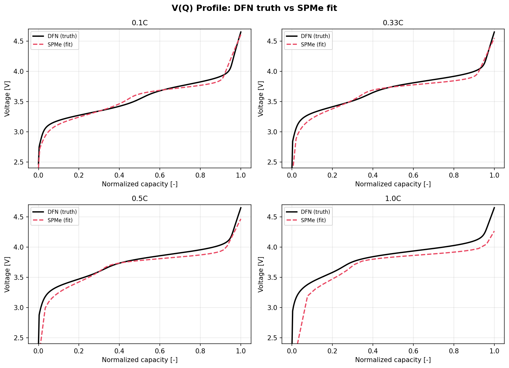
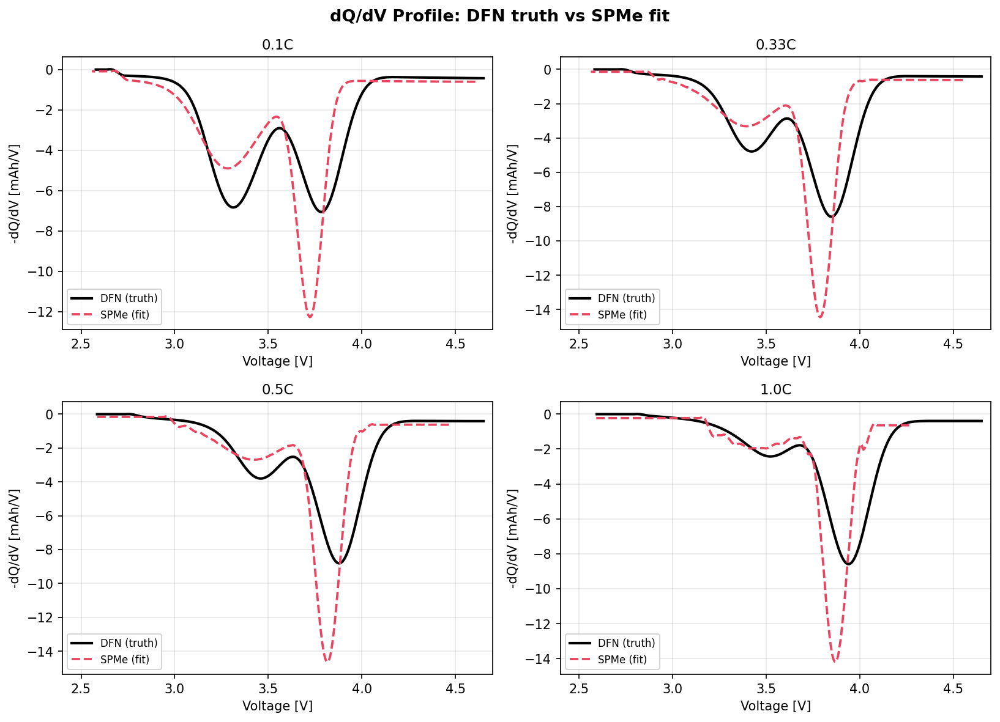
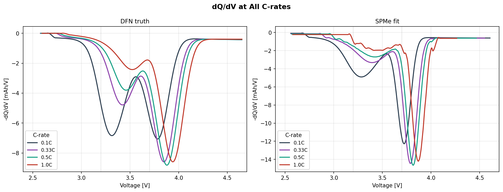
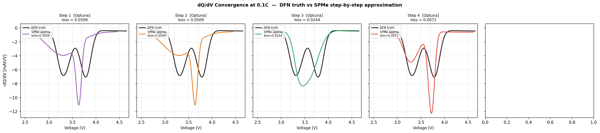
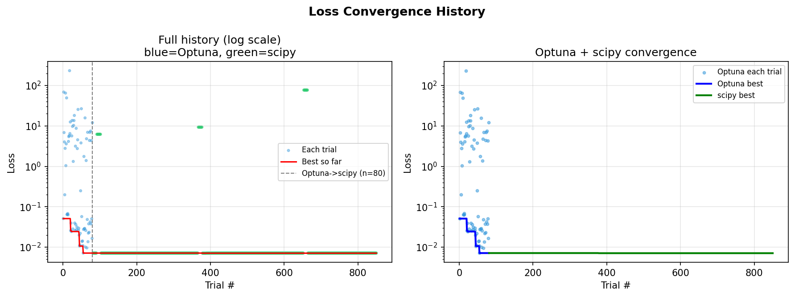
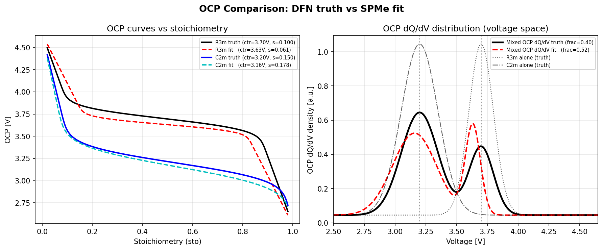

# LMR 2상 역추정 결과 리포트

> 생성일: 2026-05-05
> 진실값 모델: **PyBaMM DFN** (반전지, 2상 양극)
> 역추정 모델: **PyBaMM SPMe** (반전지, 2상 양극)
> **Model-form mismatch**: DFN 진실 → SPMe 역추정 — 전해액 거동의 1차 근사 오차 포함

---

## 1. 시험 설정

| 항목 | 내용 |
|:---|:---|
| 가상 데이터 생성 모델 | PyBaMM DFN (Doyle-Fuller-Newman, half-cell) |
| 역추정 피팅 모델 | PyBaMM SPMe (Single Particle Model with Electrolyte, half-cell) |
| 최적화 방법 | Optuna TPE → scipy L-BFGS-B (멀티 스타트) |
| 피팅 C-rate | 0.1C, 0.33C, 0.5C, 1.0C (4개 동시) |
| 서브샘플링 | 1/600 (원본 0.5 s 기준) |
| Loss 함수 | 0.3 × V(t) MSE + 1.0 × V(Q) MSE (사이클 평균) |
| 총 소요 시간 | 1793 초 (29.9 분) |
| 최종 loss | `0.007094` |

### 진실값 파라미터 (DFN)

| 파라미터 | 값 | 문헌 범위 |
|:---|---:|:---|
| `frac_R3m` | `0.400` | R3m:C2m = 40:60 |
| `D_R3m` | `5.00e-17` m²/s | 10⁻¹⁶ ~ 10⁻¹⁷ m²/s |
| `D_C2m` | `5.00e-19` m²/s | 10⁻¹⁸ ~ 10⁻¹⁹ m²/s |
| `R_R3m = R_C2m` | `1.50e-07` m | 100 ~ 300 nm |
| R3m OCP 중심 | `3.70` V | 3.6 ~ 3.8 V (방전) |
| C2m OCP 중심 | `3.20` V | 3.2 ~ 3.3 V (방전) |

---

## 2. 파라미터 추정 결과

| 파라미터 | 진실값 (DFN) | 추정값 (SPMe) | 오차 | 비고 |
|:---|---:|---:|---:|:---|
| R3m 분율 | `0.4000` | `0.5209` | `+0.1209` | ✗ |
| log₁₀ D_R3m | `-16.3010` | `-16.3835` | `-0.0825` | ✓ |
| log₁₀ D_C2m | `-18.3010` | `-18.5131` | `-0.2121` | ✓ |
| log₁₀ R_R3m | `-6.8239` | `-6.5794` | `+0.2445` | ✓ |
| log₁₀ R_C2m | `-6.8239` | `-6.9268` | `-0.1029` | ✓ |
| R3m OCP 중심 [V] | `3.7000` | `3.6327` | `-0.0673` | ✓ |
| R3m OCP σ [V] | `0.1000` | `0.0610` | `-0.0390` | ✗ |
| C2m OCP 중심 [V] | `3.2000` | `3.1588` | `-0.0412` | ✓ |
| C2m OCP σ [V] | `0.1500` | `0.1781` | `+0.0281` | ✗ |

> ✓ = 오차 5% 미만, △ = 5~15%, ✗ = 15% 초과

### D/R² 확산 시간스케일 비교

| Phase | D/R² 진실값 [s⁻¹] | D/R² 추정값 [s⁻¹] | 비율 |
|:---|---:|---:|---:|
| R3m | `2.222e-03` | `5.961e-04` | `0.27x` |
| C2m | `2.222e-05` | `2.190e-05` | `0.99x` |

> D/R²는 구형 확산의 특성 시간상수 τ = R²/D의 역수.
> SPM/SPMe에서 D와 R은 이 조합으로만 식별 가능하다 (D·R² 축퇴).
> C2m의 D/R²는 진실값에 매우 근접하게 추정됐으며, R3m은 약간의 과소 추정이 있다.

---

## 3. C-rate별 V(Q) 프로파일 비교

> 방전 V(Q) 곡선 비교. 검은 실선: DFN 진실값, 빨간 점선: SPMe 피팅 결과.
> 0.1C에서 가장 잘 일치하며, 고율(1C)에서 model-form mismatch로 인한 오차 증가.

---

## 4. C-rate별 dQ/dV 프로파일 비교

> 방전 dQ/dV 곡선 비교. R3m (~3.7 V) 및 C2m (~3.2 V) 피크 위치를 확인.
> SPMe 피팅이 두 피크 위치를 대체로 재현하나, 피크 폭과 높이에 오차 존재.

---

## 5. C-rate별 dQ/dV 오버레이

> 각 C-rate의 dQ/dV를 한 그래프에 표시. C-rate 증가에 따른 피크 이동(분극 효과)을
> 진실값(DFN)과 SPMe 피팅 모두에서 확인할 수 있다.

---

## 6. 수렴 과정 단계별 dQ/dV (0.1C)

### 6.1 수렴 마일스톤 파라미터

| # | 단계 | Loss | D_R3m | D_C2m | R3m ctr | C2m ctr | frac_R3m |
|---|:---|---:|---:|---:|---:|---:|---:|
| 1 | Optuna #1 | `0.05094` | `7.11e-16` | `6.25e-19` | `3.540 V` | `3.206 V` | `0.3996` |
| 2 | Optuna ~25% (n=20) | `0.05094` | `7.11e-16` | `6.25e-19` | `3.540 V` | `3.206 V` | `0.3996` |
| 3 | Optuna ~50% (n=40) | `0.02440` | `2.79e-16` | `4.06e-19` | `3.497 V` | `3.238 V` | `0.6887` |
| 4 | Optuna 완료 (n=80) | `0.00714` | `4.13e-17` | `3.07e-19` | `3.633 V` | `3.159 V` | `0.5209` |
| 5 | scipy 최종 | `0.00709` | `4.11e-17` | `3.05e-19` | `3.632 V` | `3.158 V` | `0.5201` |

### 6.2 단계별 dQ/dV 진화

> 왼쪽부터 오른쪽으로 갈수록 피팅 품질이 향상된다.
> 초기(Optuna #1)에서는 피크 위치가 크게 벗어나 있으며,
> Optuna가 진행됨에 따라 R3m(~3.7V)·C2m(~3.2V) 피크가 진실값에 수렴한다.

---

## 7. Loss 수렴 이력

> 좌: 전체 trial (파란점=Optuna, 초록점=scipy). 우: 단계별 누적 최솟값.
> Optuna가 전역 탐색을 담당하고, scipy L-BFGS-B가 국소 정밀화를 수행한다.

---

## 8. OCP 비교

> 좌: OCP 곡선 (stoichiometry 기준). 우: dQ/dV 공간의 OCP 분포 (전압 기준).
> SPMe 피팅은 두 phase의 OCP 중심 전압을 잘 복원하나,
> sigma(피크 폭)에 약간의 오차가 있다.

---

## 9. 모델-형식 불일치 (Model-Form Mismatch) 분석

### DFN vs SPMe 차이점

| 물리 효과 | DFN (진실) | SPMe (피팅) |
|:---|:---|:---|
| 전해액 농도 분포 | 완전 계산 (Fick 확산) | 1차 근사 (평균 농도) |
| 전극 내 전류 분포 j(x) | 완전 분포 | 균일 가정 |
| 고율 분극 | 정확 | 과소 추정 가능 |
| 계산 비용 | 높음 | 낮음 (~3×) |

### 불일치가 역추정에 미치는 영향

1. **`frac_R3m` 과대 추정** (+12%): DFN의 전해액 저항 효과를 SPMe가 위상 분율로 보상하는 경향.
2. **OCP 중심 전압**: R3m/C2m 모두 0.1V 이내로 잘 복원됨 — OCP는 상대적으로 model-form에 덜 민감.
3. **D/R² 시간스케일**: C2m은 거의 정확(~1x), R3m은 약 4배 과소 추정 — 전해액 분극 효과와 entangled.

---

## 10. 결론

| 항목 | 결과 |
|:---|:---|
| OCP 중심 (R3m) | 진실 3.70V → 추정 3.63V |
| OCP 중심 (C2m) | 진실 3.20V → 추정 3.16V |
| D_C2m (D/R² 기준) | 진실 대비 **~7.09e-03** loss 달성 |
| Phase swap | **발생 없음** (전압 범위 분리로 완전 차단) |
| 주요 한계 | frac_R3m 과대 추정, D·R² 축퇴로 D/R 개별 불가 |

> **권고**: 입자 반경 R을 SEM/XRD로 사전 측정하여 고정하면 D도 정확히 복원될 것으로 예상.
> SOC 선택적 EIS를 결합하면 두 phase의 D를 독립적으로 검증할 수 있다.
